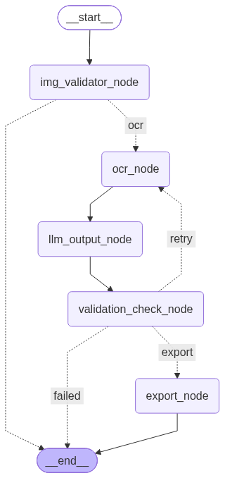

# 📄 AI Document Reconstruction

> **An Agentic AI document reconstruction pipeline built with LangGraph & LangChain.**

An experimental project that reconstructs scanned document images into editable documents using an **AI agent workflow** instead of a traditional OCR pipeline.

> 🚧 **Project Status:** Early MVP
>
> The project is under active development. Currently, only **Microsoft Word (.docx)** export is supported. **PDF export** and additional reconstruction capabilities are planned for future releases. Anything that can break will break.

---

## Workflow

The following LangGraph workflow represents the current agent orchestration pipeline.

<p align="center">
  
</p>

---

## Overview

Traditional OCR systems only extract text.

This project explores an **Agentic AI approach**, where multiple processing stages cooperate to reconstruct an editable document while preserving as much structure as possible.

Instead of directly converting an image into text, the workflow validates the input, extracts OCR blocks, reconstructs document structure, and exports the final document.

Built using:

- 🧠 LangGraph for workflow orchestration
- 🔗 LangChain for AI integration
- 🤖 OpenAI for document reconstruction
- 👁️ EasyOCR for text extraction
- ⚡ FastAPI for serving the workflow
- 📄 python-docx for document generation

---

# Why Agentic?

Unlike a linear OCR script, every stage of the reconstruction process is represented as an independent workflow node.

Current workflow includes:

- Image Validation
- OCR Extraction
- Block Sorting
- AI Reconstruction
- DOCX Export

Each node has a single responsibility and passes a shared state through the LangGraph pipeline, making the system modular and easy to extend.

Future nodes may include:

- OCR Validation
- Table Detection
- Image Reconstruction
- PDF Export
- Layout Correction
- Multi-page Processing

---

## Features (Current MVP)

✅ LangGraph workflow orchestration

✅ Shared graph state between nodes

✅ OCR extraction using EasyOCR

✅ AI-powered document reconstruction

✅ Layout-aware text block sorting

✅ DOCX document generation

✅ FastAPI REST API

---

## Tech Stack

| Category        | Technology  |
| --------------- | ----------- |
| Language        | Python      |
| Agent Framework | LangGraph   |
| LLM Framework   | LangChain   |
| LLM             | OpenAI GPT  |
| OCR             | EasyOCR     |
| Backend         | FastAPI     |
| Validation      | Pydantic    |
| Export          | python-docx |

---

## Current Workflow

```text
Image Upload
      │
      ▼
Image Validation
      │
      ▼
OCR Extraction
      │
      ▼
Sort OCR Blocks
      │
      ▼
AI Reconstruction
      │
      ▼
Generate DOCX
```

---

## Roadmap

### Phase 1 (Current)

- ✅ LangGraph orchestration
- ✅ OCR pipeline
- ✅ AI reconstruction
- ✅ DOCX export

### Phase 2

- ⏳ PDF export
- ⏳ Multi-page support
- ⏳ Better layout reconstruction
- ⏳ OCR validation
- ⏳ Table detection

### Phase 3

- ⏳ Frontend UI
- ⏳ Docker deployment
- ⏳ Async processing
- ⏳ Multiple OCR engines
- ⏳ Cloud deployment

---

## Current Limitations

Since this project is in its MVP stage:

- DOCX export is currently the only supported export format.
- PDF export is planned but not yet implemented.
- Layout reconstruction is still experimental.
- Complex tables and multi-column documents are not fully supported.
- OCR accuracy depends heavily on input image quality.

---

## Future Vision

The long-term goal is to evolve this project into a modular **Agentic Document Reconstruction System** capable of:

- Supporting multiple OCR engines
- Intelligent layout reconstruction
- Table and image preservation
- Multi-page document processing
- Multiple export formats (DOCX, PDF, Markdown)
- Human-in-the-loop validation
- Parallel agent execution
